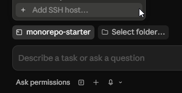
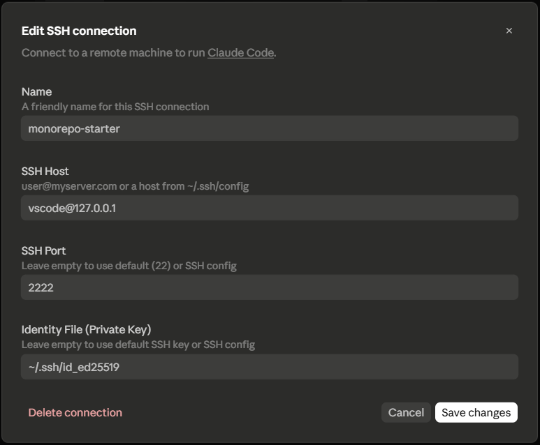

# Claude Code

This repo is pre-configured for a native [Claude Code](https://claude.ai/code) experience inside the devcontainer — including a security model that keeps AI agents from touching your git remote, and an SSH server so Claude Code Desktop can connect directly.

## Contents

- [Security model](#-security-model)
- [GitHub access via `gh` CLI](#-github-access-via-gh-cli)
- [Persistent memory and plans](#-persistent-memory-and-plans)
- [Visual debugging with Playwright](#-visual-debugging-with-playwright)
- [Connecting Claude Code Desktop via SSH](#-connecting-claude-code-desktop-via-ssh)
  - [Mac / Linux](#mac--linux)
  - [Windows](#windows)
  - [SSH config](#ssh-config-optional-but-recommended)
  - [Adding the connection in Claude Code Desktop](#adding-the-connection-in-claude-code-desktop)

---

## 🔒 Security model

The devcontainer deliberately gives AI agents **no direct git or GitHub access.** The rationale: an agent that can push code or merge PRs autonomously is a significant risk, and the upside of that autonomy is not worth it.

Concretely, `devcontainer.json` does the following:

- **Kills the SSH auth socket** (`SSH_AUTH_SOCK=`) so agents can't use forwarded keys
- **Disables all git pushes** via `pushInsteadOf` rewrites that redirect every remote URL to a disabled scheme
- **Strips credential helpers** so no stored credentials leak in

Git reads (clone, fetch, log, diff) still work fine — agents can read history and understand the codebase. They just can't write to the remote.

---

## 🐙 GitHub access via `gh` CLI

Rather than handing agents raw git credentials, GitHub access goes through the `gh` CLI authenticated with a fine-grained Personal Access Token (PAT) in your `.env` file. You decide exactly what the token can do.

This means:

- Agents can open PRs, comment on issues, and check CI status through `gh`
- **You** review and merge — agents never touch `main` directly
- If a token leaks, the blast radius is limited to one repo with restricted permissions

**Setup:** If you haven't already, copy `.env.example` to `.env` and fill in `GH_TOKEN`:

```bash
cp .env.example .env
```

Open `.env` and set `GH_TOKEN` to a fine-grained PAT scoped to this repository. See `.env.example` for the recommended permission set and a link to create one.

> [!NOTE]
> After editing `.env`, rebuild the container so the updated token is loaded — open the command palette and run **Dev Containers: Rebuild Container**. The rebuild will be fast since the image layers are cached.

---

## 🧠 Persistent memory and plans

Claude automatically maintains context across sessions using two git-tracked directories:

| Directory         | Purpose                                                              |
| ----------------- | -------------------------------------------------------------------- |
| `.claude/memory/` | Notes and facts Claude learns about the project and your preferences |
| `.claude/plans/`  | Implementation plans created during complex tasks                    |

Both survive container rebuilds and are version-controlled, so context is shared across teammates and persists indefinitely.

---

## 🎭 Visual debugging with Playwright

The devcontainer comes with the [Playwright MCP](https://github.com/microsoft/playwright-mcp) server configured, giving Claude a real browser it can drive to visually inspect and debug your frontend apps.

Claude can:

- **Navigate** to any running dev server and take screenshots
- **Interact** with the page — click, type, fill forms, trigger hover states
- **Inspect** the accessibility tree and computed styles without a screenshot
- **Debug** visually — capture a broken state, check console errors, inspect network requests

This is wired up as a `/visual-debug` skill. When working on UI, just ask Claude to take a screenshot or check how something looks and it will use the browser automatically.

> [!TIP]
> The dev server needs to be running before Claude can visit it. Start it with `pnpm dev` or `pnpm --filter <app-name> dev`, then ask Claude to inspect the page.

Screenshots Claude takes during a session are saved to `.claude/screenshots/` in the repo.

---

## 🖥️ Connecting Claude Code Desktop via SSH

The devcontainer runs a full OpenSSH server on port 2222. Claude Code Desktop connects to it using a passphrase-free SSH key.

> [!IMPORTANT]
> Claude Code does not support SSH keys with passphrases. Your key must be created with an empty passphrase (`-N ""`).

### Mac / Linux

1. Open the repo in VS Code/Cursor and select **Reopen in Container**
2. The `initializeCommand` automatically collects all `~/.ssh/*.pub` files from your home directory and authorizes them inside the container
3. Connect Claude Code Desktop to `127.0.0.1:2222` as user `vscode` (see [below](#adding-the-connection-in-claude-code-desktop))

If you don't have a passphrase-free key yet, create one then rebuild the container:

```bash
ssh-keygen -t ed25519 -f ~/.ssh/id_ed25519 -N ""
```

### Windows

> [!WARNING]
> Running the repo directly from the Windows filesystem causes significant latency once the devcontainer is running, due to the overhead of translating file operations between Windows and the container.

The recommended setup for Windows is:

1. **Clone the repo into WSL2** (e.g. `~/projects/monorepo-starter`)
2. **Open it in Cursor via the WSL2 remote**, then select **Reopen in Container**
3. **Claude Code Desktop (Windows) SSHes into the container** on port 2222

Because `initialize.bash` runs inside WSL2 to populate `authorized_keys`, but Claude Code Desktop uses the Windows SSH client to connect, **the same passphrase-free key pair must exist in both places:**

```bash
# 1. Create the key in WSL2
ssh-keygen -t ed25519 -f ~/.ssh/id_ed25519 -N ""

# 2. Copy it to Windows (run this in WSL2)
cp ~/.ssh/id_ed25519     /mnt/c/Users/<YourWindowsUsername>/.ssh/id_ed25519
cp ~/.ssh/id_ed25519.pub /mnt/c/Users/<YourWindowsUsername>/.ssh/id_ed25519.pub
```

Then open the devcontainer from Cursor. The WSL2 key is picked up automatically by `initializeCommand`; the Windows copy is what Claude Code Desktop uses to connect.

### SSH config (optional but recommended)

Adding a named host to your SSH config avoids filling in connection details every time.

**Mac / Linux** — add to `~/.ssh/config`:

```
Host monorepo-devcontainer
    HostName 127.0.0.1
    Port 2222
    User vscode
    IdentityFile ~/.ssh/id_ed25519
    IdentitiesOnly yes
    StrictHostKeyChecking no
    UserKnownHostsFile /dev/null
```

**Windows** — add to `C:\Users\<YourWindowsUsername>\.ssh\config`:

```
Host monorepo-devcontainer
    HostName 127.0.0.1
    Port 2222
    User vscode
    IdentityFile ~/.ssh/id_ed25519
    IdentitiesOnly yes
    StrictHostKeyChecking no
    UserKnownHostsFile /dev/null
```

> [!NOTE]
> `StrictHostKeyChecking no` and `UserKnownHostsFile /dev/null` are safe here because you're connecting to localhost — there is no meaningful MITM risk on `127.0.0.1`.

### Adding the connection in Claude Code Desktop

In Claude Code Desktop, click **+ Add SSH host...** and fill in the connection dialog:





| Field         | Value               |
| ------------- | ------------------- |
| Host          | `vscode@127.0.0.1`  |
| Port          | `2222`              |
| Identity file | `~/.ssh/id_ed25519` |
